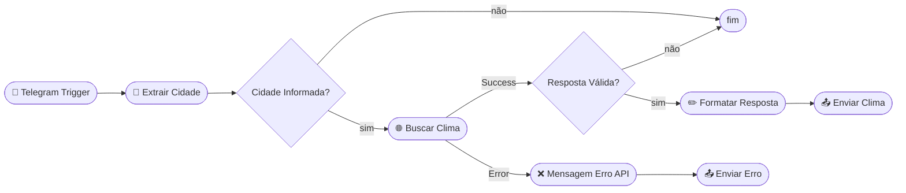

# Chatbot Clima Brasil — Telegram + N8N

Bot para Telegram que informa a temperatura atual de qualquer cidade do Brasil, construído com **N8N** e a **API do OpenWeatherMap**.

---

## 1. Como funciona

O usuário envia o nome de uma cidade diretamente no Telegram e recebe uma resposta com as condições climáticas atuais. Exemplo:

**Usuário:**
```
São Paulo
```

**Bot:**
```
☀️ Clima em São Paulo

🌡️ Temperatura: 24°C
🤔 Sensação térmica: 26°C
⬇️ Mínima: 20°C  |  ⬆️ Máxima: 28°C
💧 Umidade: 70%
💨 Vento: 12.6 km/h
📋 Condição: céu limpo

_Dados fornecidos por OpenWeatherMap_
```

Se a cidade não for encontrada, o bot responde:
```
👋 Olá! Eu sou o bot de informações sobre o clima!
❌ A Cidade que você enviou não foi encontrada.
📍 Para consultar o clima, envie o nome da cidade (ex.: São Paulo).
```

---

## 2. Estrutura do Workflow



### Descrição dos nós

| Nó | Tipo | Descrição |
|---|---|---|
| Telegram Trigger | Trigger | Escuta mensagens recebidas no bot |
| Extrair Cidade | Set Node | Captura o texto enviado pelo usuário na variável `queue` |
| Cidade Informada? | IF Node | Verifica se o campo `queue` não está vazio |
| Buscar Clima | HTTP Request | Consulta a API OpenWeatherMap com o valor de `queue` |
| Resposta Válida? | IF Node | Verifica se o `cod` da resposta é 200 (cidade encontrada) |
| Formatar Resposta | Code | Extrai e formata os dados climáticos do JSON retornado |
| Mensagem Erro API | Code | Prepara a mensagem de erro para cidade não encontrada |
| Enviar Clima | Telegram | Envia a resposta formatada ao usuário |
| Enviar Erro | Telegram | Envia a mensagem de erro ao usuário |

---

## 3. Pré-requisitos

- [N8N](https://n8n.io/) instalado (self-hosted ou cloud)
- Conta gratuita no [OpenWeatherMap](https://openweathermap.org/api) com API Key gerada
- Bot criado no Telegram via [@BotFather](https://t.me/BotFather) com o token em mãos

---

## 4. Variáveis necessárias

| Variável | Descrição |
|---|---|
| `OPENWEATHER_API_KEY` | Sua chave de API do OpenWeatherMap |
| `TELEGRAM_BOT_TOKEN` | Token do seu bot criado no BotFather |

### Como configurar no terminal (self-hosted)

Exporte as variáveis antes de iniciar o N8N:

```bash
export OPENWEATHER_API_KEY=sua_chave_aqui
n8n start
```

Ou crie um arquivo `.env` na pasta do N8N:

```env
OPENWEATHER_API_KEY=sua_openweather_key_aqui
```

---

## 5. Como importar o workflow no N8N

1. Abra o painel do N8N no navegador;
2. No menu lateral, clique em **Workflows**;
3. Clique no botão **Import**;
4. Selecione o arquivo `workflow-chatbot-telegram.json`;
5. O workflow será carregado com todos os nós configurados.

---

## 6. Como inserir as credenciais no N8N

### Credencial do Telegram

1. No N8N, vá em **Settings → Credentials → Add Credential**;
2. Busque por **Telegram**;
3. No campo **Access Token**, cole o token do seu bot (`TELEGRAM_BOT_TOKEN`);
4. Salve com o nome `Telegram account`;
5. Os nós **Telegram Trigger**, **Enviar Clima** e **Enviar Erro** já referenciam essa credencial.

### Chave do OpenWeatherMap

No nó **Buscar Clima**, o parâmetro `appid` deve conter sua chave da API do OpenWeatherMap. Você pode inserir:

- Diretamente no campo `appid`: cole sua chave como texto simples;
- Via variável de ambiente: use `{{ $env.OPENWEATHER_API_KEY }}` (requer configuração prévia no terminal).

---

## 7. Como testar o chatbot

Após importar o workflow e configurar as credenciais:

1. **Ative o workflow** clicando no botão no canto superior direito do editor;
2. Abra o Telegram e encontre o seu bot pelo nome;
3. Envie os seguintes testes:

| Mensagem enviada | Resultado esperado |
|---|---|
| `São Paulo` | Retorna temperatura atual de São Paulo |
| `Rio de Janeiro` | Retorna temperatura atual do Rio de Janeiro |
| `Curitiba` | Retorna temperatura atual de Curitiba |
| `CidadeInexistente` | Retorna mensagem de erro com instruções |

---
