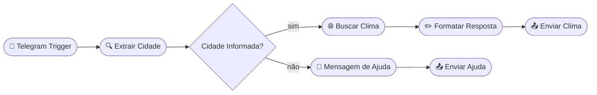

# Chatbot Clima Brasil — Telegram + N8N

Bot para Telegram que informa a temperatura atual de qualquer cidade do Brasil, construído com **N8N** e a **API do OpenWeatherMap**.

## 1- Como funciona
O usuário envia uma mensagem via telegram para o bot com o nome da cidade e recebe uma resposta com as condições climáticas atuais, conforme o exemplo a seguir:

**Usuário:** 
/tempo São Paulo
OU
São Paulo

**Bot:**
☀️ Clima em São Paulo

🌡️ Temperatura: 24°C

🤔 Sensação térmica: 26°C

⬇️ Mínima: 20°C  |  ⬆️ Máxima: 28°C

💧 Umidade: 70%

💨 Vento: 12.6 km/h

📋 Condição: céu limpo

## 2- Estrutura do Workflow

## 3- Pré-requisitos
- n8n instalado
- Conta no OpenWeatherMap
- Bot criado no Telegram 
- Ferramentas para rodar localmente ou em servidor
